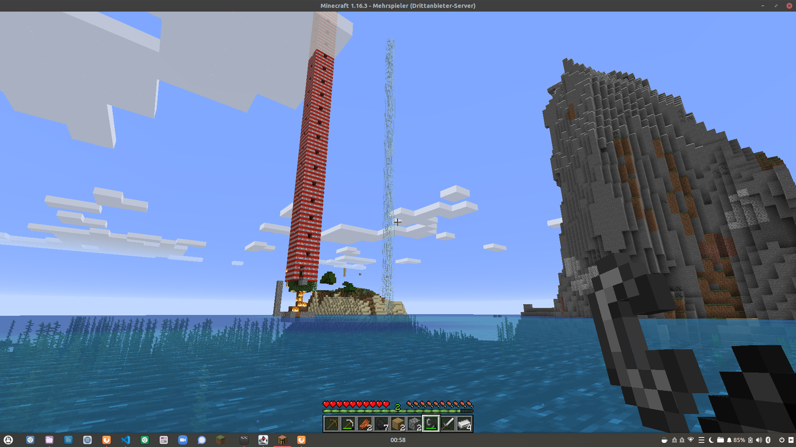
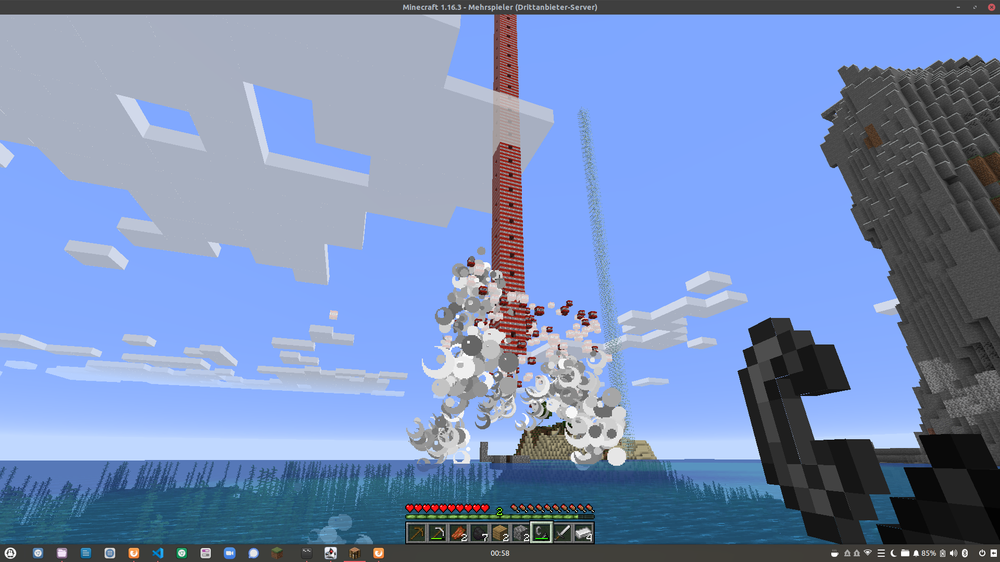
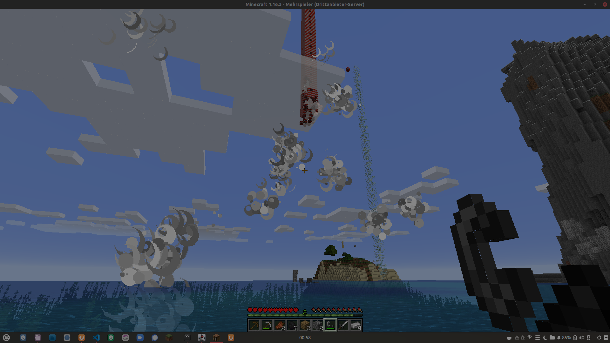
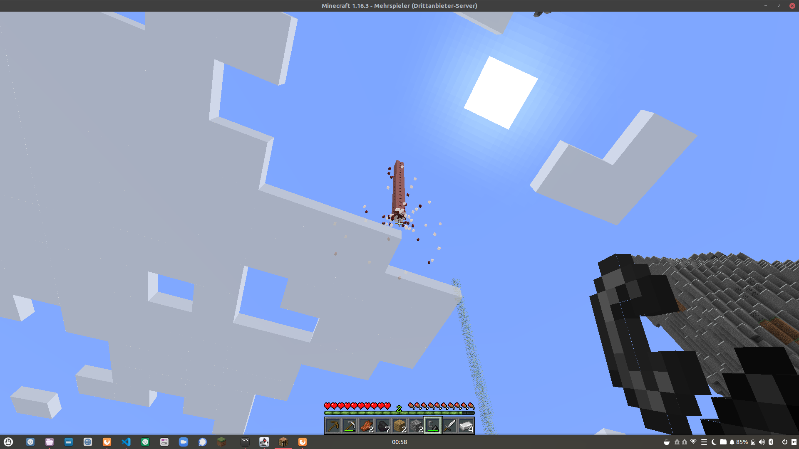

# Tower Plugin
<table>
  <tr>
    <td>
      
    </td>
    <td>
      
    </td>
  </tr>
  <tr>
    <td>
      
    </td>
    <td>
      
    </td>
  </tr>
 </table>
Mit diesem Plugin für Minecraft könnt ihr einen begehbaren Turm von beliebiger Höhe aus verschiedensten Materialen erstellen. Dieses Plugin wurde auf Basis von Daniel Brauns Buch [Let's play Minecraft programmieren lernen mit Python und Minecraft](https://www.daniel-braun.com/buch/lets-play-minecraft-programmieren-lernen-mit-python-und-minecraft-2-auflage/)

## Installation:

Befolgt die Installationsanweisungen aus obigen Buch, so dass Eurer Minecraftserver Python-Plugins unterstützt.
Danach installiert ihr das Plugin wie folgt:

``` sh
cd <minecraft-server-verzeichnis>/plugins
git clone git@github.com:fonzerelly/minecraft_tower.git tower.py.dir
```

## Anwendung:

Als Minecraft spieler gebt ihr "t" ein um Befehle an den Serverabzugeben und
/tower <höhe> <material?>

legt einen Turm in Eurer Nähe an in der Höhe von <höhe> Blöcken, aus COBBLESTONE oder einem Material Eurer Wahl an. Aktuell werden unterstützt:
* GOLD
* TNT
* OBSIDIAN
* COAL
* GLASS
* AIR
* GRAVEL
* SAND
* REDSTONE
* CHEST
* DIAMOND
* WATER
* IRON

ACHTUNG!
Vor allem Türme aus Wasser lassen sich so gut wie gar nicht mehr beseitigen!
Viel Spaß :)
